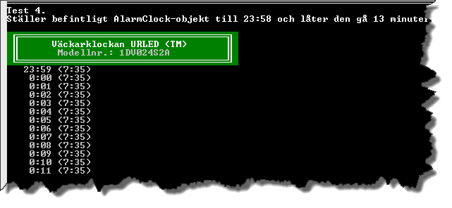
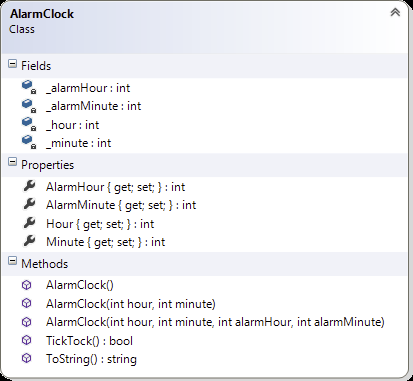
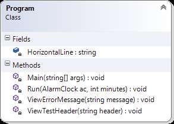

# Digital väckarklocka - nivå A

## Problem

Digitala klockor visar tiden med siffror. Två sorters visning förekommer:

* 24-timmars som visar 0:00 – 23:59
* 12 timmars som visar 1:00 – 12:59

Du ska skriva ett program som simulerar en 24-timmars digital klockdisplay, genom att skapa och använda dig av klassen ```AlarmClock```. Förutom att hålla ordning på aktuell tid ska  klassen även kunna hantera en alarmtid. Du kontrollerar att klassen fungerar som det är tänkt genom att skriva ett mindre test.  


Figur A.1. Exempel på resultat vid test av klassen AlarmClock.

#####Hantering av timmar och minuter

Den digitala klockdisplayen ska presentera tiden i timmar och minuter, t.ex. 9:57. Värdet till vänster om kolontecknet är timmarna, som går från 0 till och med 23. Passeras 23 ska värdet sättas till 0. Värdet till höger är minuterna. Giltiga värden för dessa är 0 till och med 59. Passeras 59 ska värdet sättas till 0.

I princip handlar det om att låta en tidpunkt utgöras av två värden som presenteras åtskilda av ett kolon (:). Med andra ord kan en tidpunkt hanteras med hjälp av två heltal i form av två privata fält i klassen ```AlarmClock```. För att säkerställa att fälten verkligen inte tilldelas felaktiga värden måste dessa kapslas in av publika egenskaper, vars set-metoder kastar undantag om försök görs att tilldela egenskaperna ogiltiga värden.

#####Test av klassen

För att säkerställa att klassen ```AlarmClock``` uppfyller ställda krav ska ett enklare test skrivas som visar detta. Testet ska innehålla kod som verifierar att konstruktorer, egenskaper och metoder fungerar. Efter att klassen ```AlarmClock``` har implementerats ska testkoden skrivas i metoden ```Main()``` i klassen ```Program``` samt bestå av sju deltester:

_Testlista_

1. Test av standardkonstruktor.
	
	För att kontrollera det nya objektets status, ska en sträng som representerar värdet av objektet skrivas ut. I konsolfönstret presenteras därmed "0:00 (0:00)" om standardkonstruktorn fungerar som den ska:
	
	
	
	Figur A.2.
	
2. Test av konstruktorn med två parametrar.
	
	Argumenten 9 och 42 ska användas då ett nytt objekt skapas. Tiden som ska skrivas ut är "9:42 (0:00)".
	
	
	
	Figur A.3.
	
3. Test av konstruktorn med fyra parametrar.
	
	Argumenten 13, 24, 7 och 35 ska användas då ett nytt objekt skapas. Tiden som ska skrivas ut är "13:24 (7:35)".
	
	
	
	Figur A.4.
	
4. Test av metoden ```TickTock()``` som ska låta klockan gå en minut.
	
	Ställ ett befintligt ```AlarmClock```-objekt till 23:58 och låt väckarklockan gå 13 minuter. Lista med 13 tider ska skrivas ut där minutvärdet ökar med en minut för varje tid.
	
	Timmar ska gå från 23 till 0 och i de fall timmar utgörs av ett ental ska timmen beskrivas med enbart en siffra. När minuterna är ental ska beskrivningen av minuten inledas med 0.
	
	
	
	Figur A.5.
	
5. Ställer befintligt ```AlarmClock```-objekt till tiden 6:12 och alarmtiden till 6:15 och låter klockan gå 6 minuter. Testkoden ska på lämpligt sätt indikera när ett alarm går.
	
	
	
	Figur A.6.
	
6. Test av egenskaperna så att undantag kastas då tid och alarmtid tilldelas felaktiga värden.
	
	
	
	Figur A.7.
	
	(Av felmeddelandena framgår inte att det första och andra meddelandet berör väckarklockans tid och det tredje och fjärde felmeddelandet berör väckarklockans alarmtid.)
	
7. Test av konstruktorer så att undantag kastas då tid och alarmtid tilldelas felaktiga värden.
	
	
	
	Figur A.8.
	
	(Av felmeddelandena framgår inte att det första meddelandet berör väckarklockans tid och det andra felmeddelandet berör väckarklockans alarmtid.)
			
#####Klassen AlarmClock

Klassen ```AlarmClock``` måste implementeras så den som minst innehåller medlemmarna enligt klassdiagrammet i Figur A.9 och har den funktionalitet som beskrivs för respektive medlem.



Figur A.9. Klassdiagram för klassen AlarmClock.

_Fältet_ __alarmHour_

Privat fält som innehåller värdet för alarmtimmen. Kapslas in av egenskapen ```AlarmHour```.

_Fältet_ __alarmMinute_

Privat fält som innehåller värdet för alarmminuten. Kapslas in av egenskapen ```AlarmMinute```.

_Fältet_ __hour_

Privat fält som innehåller värdet av timmen för aktuellt klockslag. Kapslas in av egenskapen ```Hour```.

_Fältet_ __minute_

Privat fält som innehåller värdet av minuten för aktuellt klockslag. Kapslas in av egenskapen ```Minute```.

_Egenskapen AlarmHour_

Egenskap, som kapslar in det privata fältet ```_alarmHour```. ```set```-metoden måste validera att värdet, som ska tilldelas ```_alarmHour```, är i det slutna intervallet mellan 0 och 23 innan fältet tilldelas. Uppfyller värdet inte detta villkor ska ett undantag av typen ```ArgumentException``` kastas.

_Egenskapen AlarmMinute_

Egenskap, som kapslar in det privata fältet ```_alarmMinute```. ```set```-metoden måste validera att värdet, som ska tilldelas ```_alarmMinute```, är i det slutna intervallet mellan 0 och 59 innan fältet tilldelas. Uppfyller värdet inte detta villkor ska ett undantag av typen ```ArgumentException``` kastas.

_Egenskapen Hour_

Egenskap, som kapslar in det privata fältet ```_hour```. ```set```-metoden måste validera att värdet, som ska tilldelas ```_hour```, är i det slutna intervallet mellan 0 och 23 innan fältet tilldelas. Uppfyller värdet inte detta villkor ska ett undantag av typen ```ArgumentException``` kastas.

_Egenskapen Minute_

Egenskap, som kapslar in det privata fältet ```_minute```. ```set```-metoden måste validera att värdet, som ska tilldelas ```_minute```, är i det slutna intervallet mellan 0 och 59 innan fältet tilldelas. Uppfyller värdet inte detta villkor ska ett undantag av typen ```ArgumentException``` kastas.

_Konstruktorerna_

Konstruktorerna, som är tre till antalet, ska se till att ett ```AlarmClock```-objekt blir korrekt initierat. Det innebär att fälten ska tilldelas lämpliga värden.

Standardkonstruktorn ```AlarmClock()``` ska initiera fälten till deras standardvärden. Ingen tilldelning får ske i konstruktorns kropp, som måste vara tom. Denna konstruktor måste därför anropa den konstruktor i klassen som har två parametrar.

Med konstruktorn ```AlarmClock(int hour, int minute)``` ska ett objekt kunna initieras så att alarmklockan ställs på den tid som parametrarna för timme respektive minut anger. Ingen tilldelning får ske i konstruktorns kropp, som måste vara tom. Denna konstruktor måste därför anropa den konstruktor i klassen som har fyra parametrar.

Med konstruktorn ```AlarmClock(int hour, int minute , int alarmHour, int alarmMinute)``` ska ett objekt kunna initieras så att alarmklockan ställs på den tid och alarmtid som parametrarna anger. Detta är den enda av konstruktorerna som får innehålla kod som leder till att fält i klassen tilldelas värden.

_Metoden TickTock_

Publik metod som anropas för att få klockan att gå en minut. Om den nya tiden överensstämmer med alarmtiden ska metoden returnera ```true```, annars ```false```. Inga utskrifter till konsolfönstret får göras av metoden.

Metoden ansvarar för att öka minuternas värde med 1. Värdet för minuterna måste vara i det slutna intervallet mellan 0 och 59. Då värdet för minuterna sätts till 0 ökas lämpligen timmarnas värde med 1. Värdet för timmarna måste vara i det slutna intervallet mellan 0 och 23.

_Metoden ToString_

Publik metod som representerar värdet av en instans av klassen. Den har som uppgift att beskriva aktuellt ```AlarmClock-objekt``` i form av en returnerad sträng innehållande aktuell tid samt alarmtiden inom parenteser. Inga utskrifter till konsolfönstret får göras av metoden.

Tiderna ska presenteras på formatet HH:mm, d.v.s. timmar och minuter separerade av kolon (:). Är timmen ett ental ska enbart entalet visas. Är minuten ett ental ska presentationen av minuten inledas med 0. Exempel: Är klockan fem över elva på kvällen ska tiden presenteras som 23:05. Är tiden åtta minuter över sju på morgonen ska tiden presenteras som 7:08.

#####Klassen Program

Denna klass ska innehålla koden som testar klassen ```AlarmClock```.

Figur A.10 visar ett förslag på medlemmar som kan användas för att skapa de sju testerna under rubriken ”Testlista” ovan. Klassen ```Program``` måste dock inte följa förslaget, vilket enbart ska ses som en rekommendation. Det finns bara ett krav som måste uppfyllas och det är att metoden ```Main()``` måste se till att de sju deltesterna genomförs på avsett sätt.



Figur A.10. Förslag på medlemmar i klassen Program.

_Metoden Main_

Metoden ska instansiera objekt av klassen ```AlarmClock``` och testa dess konstruktorer, egenskaper och metoder.

_Metoden Run_

Privat statisk metod som har två parametrar. Den första parametern är en referens till ett ```AlarmClock-objekt```. Den andra parametern är antalet minuter som ```AlarmClock-objektet``` ska gå (vilket lämpligen görs genom att låta ett ```AlarmClock-objekt``` göra upprepade anrop av metoden ```TickTock()```)

_Metoden ViewErrorMessage_

Privat statisk metod som tar ett felmeddelande som argument och presenterar det.


Figur A.11. Exempel på presentation av två felmeddelanden.

_Metoden ViewTestHeader_

Privat statisk metod som tar en sträng som argument och presenterar strängen.


Figur A.12. Exempel på ett tests rubrik inklusive horisontell linje ovan testrubriken.

## A-Krav

1. Klassen ```AlarmClock``` ska implementeras enligt klassdiagrammet i Figur A.9 samt tillhörande beskrivning av respektive medlemsmetod.
2. Då ett nytt ```AlarmClock```-objekt instansieras, ska undantag kastas av klassen om försök görs att initiera objektet med ogiltiga värden (dvs. som inte ligger inom angivna intervall för timmar och minuter).
4. Ingen av medlemmarna i klassen ```AlarmClock``` får skriva ut något i konsolfönstret.
4. Klassen ```Program``` måste implementeras så att de sju deltesterna under rubriken ”Testlista” körs när programmet exekveras. Var och en av testerna måste lyckas, vilket ska kunna verifieras genom lämpliga utskrifter i konsolfönstret.

## Tips

Läs om:

+ Klasser
	+ Essential C# 6.0, 217-228.
	+ //msdn.microsoft.com/en-us/library/0b0thckt.aspx
+ Åtkomstmodifierare (”_Access Modifiers_”)
	+ Essential C# 6.0, 235-237.
	+ //msdn.microsoft.com/en-us/library/ms173121.aspx
+ Egenskaper
	+ Essential C# 6.0, 237-244.
	+ //msdn.microsoft.com/en-us/library/x9fsa0sw.aspx
+ Konstruktorer
	+ Essential C# 6.0, 254-263.
	+ //msdn.microsoft.com/en-us/library/k6sa6h87.aspx

[Lösning](losning/)